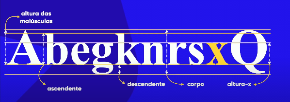

# TIPOGRAFIA - ESTUDO DOS TIPOS DE GRAFIAS|ESCRITAS

> **Utilizar letras que melhor transmite a emoção do que se deseja representar.**

## ANATOMIA DO TIPO

- A letra X é o ponto de partida para a construção de todas as fontes
 
- METRICA ALTURA-"X" - Define a altura base de todas as letras minusculas.

 <!---->

### SERIFA

lIVESERVE

File > Prefrences > Settings; Copy and paste liveServer

